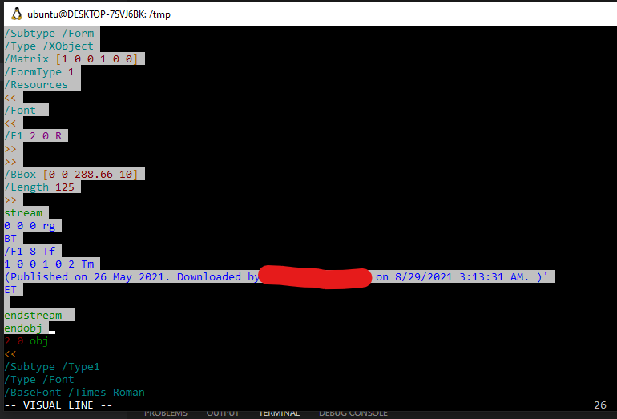
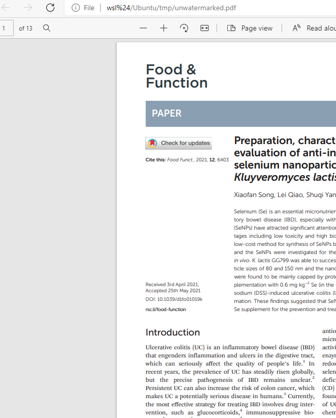

# background
When I downloaded a scholar paper from a library database, rsc, the pdf file of paper will be added a text watermark to mark your right. However, it's so ugly and prevents sharing. So I decided to remove it.


# Solution

### commercial

| Solution                | Pros                                   | Cons                |
| ----------------------- | -------------------------------------- | ------------------- |
| Adobe pdf pro + pitstop | search and replace, batch modification | too heavy           |
| Foxit PhantomPDF        | search and replace                     | manual modification |


### Open Source

pdftk, qpdf + vim, sed, awk

# Operation
```
sudo apt install pdftk
```

### Remove


Most of PDF file will be compressed to reduce the file size. So we need to uncompress it, and go to the next step.
```
pdftk xxx.pdf output uncompressed.pdf uncompress
```

Open the uncompressed file, press `/watermark_string` to find the location of the object.
`shift` + `v` to select multiple line and `delete` them.
```
vim uncompressed.pdf
```


Finally, compress the modified file and save.
```
pdftk uncompressed.pdf output unwatermarked.pdf compress
```


### Add

```
pdftk original.pdf multistamp watermark.pdf output final.pdf
```

